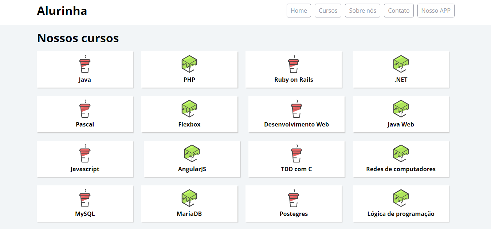
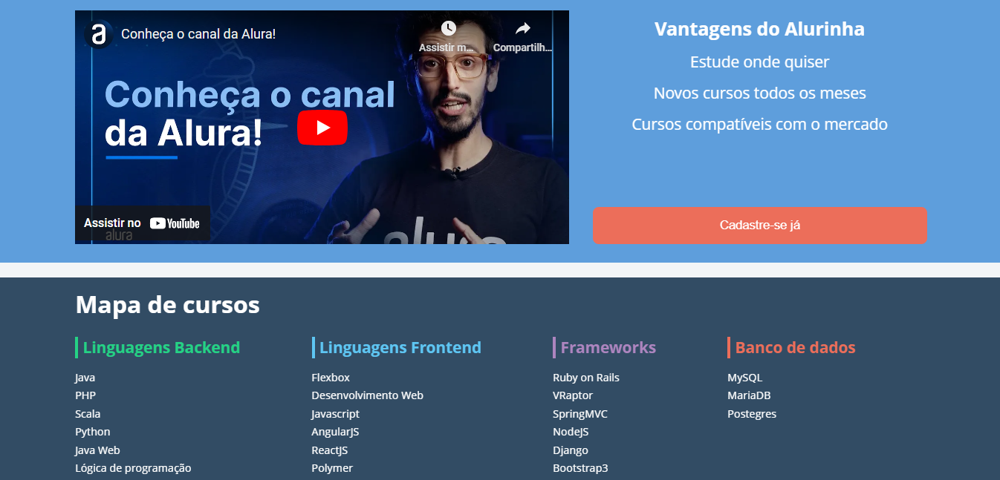

# Alurinha 

Nesse projeto feito durante o curso de <b>Flexbox</b> da <b>Alura</b>, onde eu desenvolvi um site explorando as especificações do flexible box para posicionar os elementos na página e responsivo.

<h2>Tópicos abordados durante esse projeto:<h2>
<ul>
    <li>Especificação flexible box para posicionar elementos na página</li>
    <li>Propriedades do flexbox e como usá-las</li>
    <li>Elabore um site responsivo com flexbox</li>
</ul>

<h3>Contribuindo</h3>

⭐️ Star o projeto

🐛 Encontrar e relatar issues